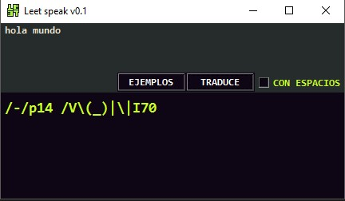
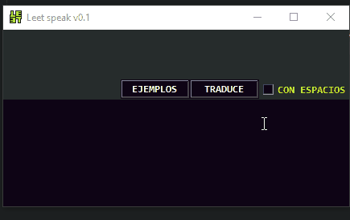

# Leet speak
hecho con tkinter  y python 3.10

traduce texto a caracteres similares, la idea de hacer este programa se me ocurrio luego de ver esta [pagina](https://www.gamehouse.com/blog/leet-speak-cheat-sheet/) que explica de que se trata esta forma de escribir (esta en ingles)

 **como funciona:** Le agregas texto en la parte de arriba pulsa el boton traduce y muestra la traduccion abajo.

## Caracteristicas
* Si no esta muy claro cada letra puedes activar el checkbox `con espacios` para muestre un espacio entre cada letra para poder reconocerlas de mejor manera
* Tienes solo algunas palabras o frases de ejemplo las elige de manera aleatoria, cuando presionas ejemplos
* Al momento de traducir tambien muestra distintos resultados

